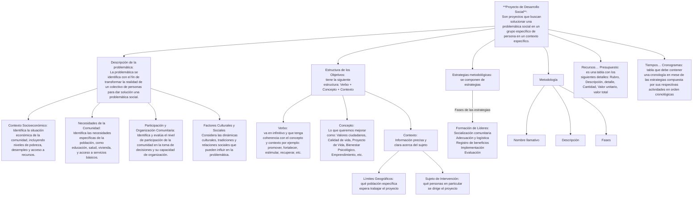

```mermaid
graph TD;
    A[**Proyecto de Desarrollo Social**: <br> Son proyectos que buscan solucionar una problemática social en un grupo específico de persona en un contexto específico.] --> B[Descripción de la problemática: <br> La problemática se identifica con el fin de transformar la realidad de un colectivo de personas para dar solución una problemática social.]
    B --> B1[Contexto Socioeconómico: <br> Identifica la situación económica de la comunidad, incluyendo niveles de pobreza, desempleo y acceso a recursos.]
    B --> B2[Necesidades de la Comunidad: <br> Identifica las necesidades específicas de la población, como educación, salud, vivienda, y acceso a servicios básicos.]
    B --> B3[Participación y Organización Comunitaria: <br> Identifica y evalúa el nivel de participación de la comunidad en la toma de decisiones y su capacidad de organización.]
    B --> B4[Factores Culturales y Sociales <br> Considera las dinámicas culturales, tradiciones y relaciones sociales que pueden influir en la problemática.]
    A --> C[Estructura de los Objetivos: <br> tiene la siguiente estructura: Verbo + Concepto + Contexto]
    C --> C1[Verbo: <br> va en infinitivo y que tenga coherencia con el concepto y contexto por ejemplo: promover, fortalecer, estimular, recuperar, etc.]
    C --> C2[Concepto: <br> Lo que queremos mejorar como: Valores ciudadanos, Calidad de vida, Proyecto de Vida, Bienestar Psicológico, Emprendimiento, etc.]
    C --> C3[Contexto: <br> Información precisa y clara acerca del sujeto]
    C3 --> C31[Límites Geográficos: <br> qué población específica espera trabajar el proyecto]
    C3 --> C32[Sujeto de Intervención: <br> qué personas en particular se dirige el proyecto]
    A --> D[Estrategias metodológicas: <br> se componen de estrategias]
    D -->|Fases de las estrategias| E[Formación de Líderes: <br> Socialización comunitaria <br> Adecuación y logística <br> Registro de beneficios <br> Implementación <br> Evaluación]
    A --> F[Metodología]
    F --> F1[Nombre llamativo]
    F --> F2[Descripción]
    F --> F3[Fases]
    A --> G[Recursos… Presupuesto: <br> es una tabla con los siguientes detalles: Rubro, Descripción, detalle, Cantidad, Valor unitario, valor total]
    A --> H[Tiempos… Cronogramas: <br> tabla que debe contener una cronología en mese de las estrategias compuesta por sus respectivas actividades en orden cronológicas]
```
