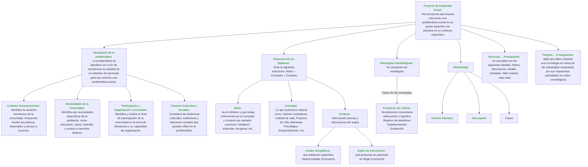

```mermaid
graph TD;
    A[<span style="color:green">Proyecto de Desarrollo Social</span>: <br> Son proyectos que buscan solucionar una problemática social en un grupo específico de persona en un contexto específico.] --> B[<span style="color:green">Descripción de la problemática</span>: <br> La problemática se identifica con el fin de transformar la realidad de un colectivo de personas para dar solución una problemática social.]
    B --> B1[<span style="color:green">Contexto Socioeconómico</span>: <br> Identifica la situación económica de la comunidad, incluyendo niveles de pobreza, desempleo y acceso a recursos.]
    B --> B2[<span style="color:green">Necesidades de la Comunidad</span>: <br> Identifica las necesidades específicas de la población, como educación, salud, vivienda, y acceso a servicios básicos.]
    B --> B3[<span style="color:green">Participación y Organización Comunitaria</span>: <br> Identifica y evalúa el nivel de participación de la comunidad en la toma de decisiones y su capacidad de organización.]
    B --> B4[<span style="color:green">Factores Culturales y Sociales</span>: <br> Considera las dinámicas culturales, tradiciones y relaciones sociales que pueden influir en la problemática.]
    A --> C[<span style="color:green">Estructura de los Objetivos</span>: <br> tiene la siguiente estructura: Verbo + Concepto + Contexto]
    C --> C1[<span style="color:green">Verbo</span>: <br> va en infinitivo y que tenga coherencia con el concepto y contexto por ejemplo: promover, fortalecer, estimular, recuperar, etc.]
    C --> C2[<span style="color:green">Concepto</span>: <br> Lo que queremos mejorar como: Valores ciudadanos, Calidad de vida, Proyecto de Vida, Bienestar Psicológico, Emprendimiento, etc.]
    C --> C3[<span style="color:green">Contexto</span>: <br> Información precisa y clara acerca del sujeto]
    C3 --> C31[<span style="color:green">Límites Geográficos</span>: <br> qué población específica espera trabajar el proyecto]
    C3 --> C32[<span style="color:green">Sujeto de Intervención</span>: <br> qué personas en particular se dirige el proyecto]
    A --> D[<span style="color:green">Estrategias metodológicas</span>: <br> se componen de estrategias]
    D -->|Fases de las estrategias| E[<span style="color:green">Formación de Líderes</span>: <br> Socialización comunitaria <br> Adecuación y logística <br> Registro de beneficios <br> Implementación <br> Evaluación]
    A --> F[<span style="color:green">Metodología</span>]
    F --> F1[<span style="color:green">Nombre llamativo</span>]
    F --> F2[<span style="color:green">Descripción</span>]
    F --> F3[Fases]
    A --> G[<span style="color:green">Recursos… Presupuesto</span>: <br> es una tabla con los siguientes detalles: Rubro, Descripción, detalle, Cantidad, Valor unitario, valor total]
    A --> H[<span style="color:green">Tiempos… Cronogramas</span>: <br> tabla que debe contener una cronología en mese de las estrategias compuesta por sus respectivas actividades en orden cronológicas]
```
